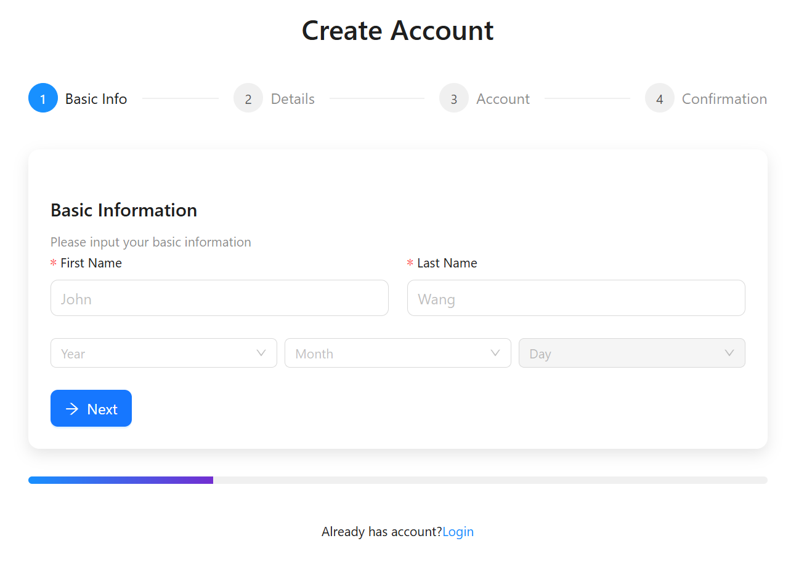

# Project Introduction

This project is a mutliple-step user registration form using React and antd.

### Step up instructions 
1. Install [node js](https://nodejs.p2hp.com/download/)
2. `npm install`

### Run on local
`npm start`

Runs the app in the development mode.\
Open [http://localhost:3000](http://localhost:3000) to view it in the browser.

The page will reload if you make edits.\
You will also see any lint errors in the console.

### Run unit test on local
`npm test`

antd has compitiable issue with @testing-library/, need more investigation, so use cypress to e2e test.
Launches the test runner in the interactive watch mode.\
See the section about [running tests](https://facebook.github.io/create-react-app/docs/running-tests) for more information.

### Open cypress e2e test
`npm run e2e:open`

### Run cypress e2e test
`npm run e2e:run`

### Screenshot
